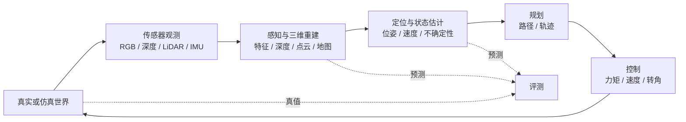

# Day 001｜2026-09-04｜研究地图与基线测试

> **今天的终点**：在 2–4 小时内建立整条路线的系统地图，完成一份诚实的能力基线，并独立运行一个“概率分布 → 香农熵”的 Python 小程序。今天不安装 ROS 2、COLMAP、ORB-SLAM3 或 Gazebo。

## 0. 今日信息

| 项目 | 内容 |
|---|---|
| 周次 | Week 01：环境、Python、Git 与科研记录 |
| 核心时长 | 120 分钟 |
| 标准时长 | 180 分钟 |
| 进阶上限 | 240 分钟 |
| 前置知识 | 会打开终端和文本编辑器；不会 Python 也可以 |
| 必需软件 | Python 3；Git；任意 Markdown 编辑器 |
| 可选软件 | JupyterLab / Jupyter Notebook |
| 当日提交物 | `notes/Day001.md`、`experiments/Day001/baseline.md`、熵函数运行记录 |
| 合格线 | 80/100；低于 80 分先按补学建议修正 |

### 开始前的 3 分钟检查

在终端执行：

```bash
cd "/Users/meng/Documents/ChatGPT/每日基础学习"
python3 --version
git --version
git status --short --branch
```

成功标志：前两条显示版本号；最后一条显示当前 Git 分支。Python 版本只要是 3.10 或更新版本即可完成今天的任务。

## 1. 可检测的学习目标

完成今天学习后，你应当能够：

1. 用自己的话解释三维重建、定位/SLAM、规划、控制和仿真的输入与输出。
2. 解释 RGB 图像、深度图、点云、位姿、轨迹和控制量的典型 shape、单位或坐标系。
3. 写出 3 个你真正想解决的研究问题，并用统一的 0–5 量表评价当前能力。
4. 使用 Python 的变量、列表、字典、循环、切片和函数完成一个小程序。
5. 根据公式计算离散香农熵，并解释为什么确定事件的熵为 0、公平二元事件的熵为 1 bit。
6. 从干净终端重新运行代码，得到与课件一致的关键结果。

## 2. 为什么第一天先画地图

这条路线同时包含互信息、多模态学习、医学图像、三维重建、机器人和仿真。它们并不是互不相关的课程，而是一条“观测—估计—决策—执行—再观测”的闭环：



多模态学习关心如何组合多个观测来源；互信息关心一个变量对另一个变量减少了多少不确定性；三维重建和 SLAM 把图像、深度或惯性观测转化为几何结构和位姿；规划与控制再把估计结果转化为动作；仿真提供可重复的输入和真值。

今天不追求掌握每个算法，而是先让每个名词都有明确的输入、输出和失败条件。以后遇到新模型时，先问四个问题：

1. 输入是什么，shape、单位、坐标系和时间戳是什么？
2. 输出是什么，如何与真值比较？
3. 隐含假设是什么？
4. 哪种数据会让系统失败？

## 3. 五个系统模块的输入—输出

### 3.1 三维重建（Reconstruction）

- **输入**：从不同视角采集、具有重叠区域的 RGB 图像；也可能包含相机内参或深度图。
- **输出**：相机内外参数、稀疏/稠密点云、网格或神经场。
- **核心问题**：同一个三维点在不同图像中投影到了哪里？
- **典型失败**：图像没有纹理、重叠不足、强反光、光照剧烈变化或只有纯旋转。

COLMAP 官方教程把经典增量式 SfM 概括为特征提取、特征匹配与几何验证、结构与运动恢复三个阶段；SfM 的输出可继续作为 MVS 的输入以获得更稠密的重建。今天只读其流程图和前三段，不安装软件。

### 3.2 定位与 SLAM

- **输入**：随时间到来的相机、IMU、LiDAR、轮速计等传感器数据。
- **输出**：机器人随时间变化的位姿，以及可选的环境地图。
- **位姿记号**：`T_WB(t)` 表示时刻 `t` 从机器人机体坐标系 `B` 到世界坐标系 `W` 的变换。
- **典型失败**：运动模糊、重复纹理、动态物体、IMU 偏置、时间不同步或尺度不可观。

“定位”和“建图”互相依赖：不知道相机在哪里，就难以把观测放进同一张地图；没有地图，又缺少用于定位的参照。ORB-SLAM3 是后续会接触的视觉/视觉惯性/多地图 SLAM 实例，今天只观察它支持的传感器配置和输入文件。

### 3.3 规划（Planning）

- **输入**：当前状态 `x_t`、目标 `x_goal`、地图或障碍物、机器人运动约束。
- **输出**：无碰撞路径，或带时间信息的轨迹 `x*(t), u*(t)`。
- **典型失败**：地图过期、目标不可达、约束建模错误、搜索空间过大。

路径通常只描述“从哪里经过”；轨迹还包含“什么时候到达”和速度/加速度等时间信息。

### 3.4 控制（Control）

- **输入**：期望状态/轨迹、测得或估计的当前状态。
- **输出**：速度、转角、力或力矩等执行器命令 `u_t`。
- **典型失败**：延迟、执行器饱和、模型失配、状态估计漂移。

最小反馈思想可写成：

\[
e_t = x_t^{\text{desired}} - x_t^{\text{measured}}, \qquad
u_t = K e_t,
\]

其中 `e_t` 是误差，`K` 是控制增益。今天只需理解：控制器根据“想去哪里”和“现在在哪里”的差异产生动作。

### 3.5 仿真（Simulation）

- **输入**：世界、机器人模型、传感器模型、物理参数、控制命令和随机种子。
- **输出**：机器人状态、合成传感器数据、碰撞信息和真值。
- **典型失败**：模型与真实世界差距过大，即 sim-to-real gap；或仿真本身没有固定版本和随机种子。

Gazebo 使用 SDF 描述世界和模型，能产生 IMU、LiDAR 等传感器流。它的价值不只是“显示三维动画”，而是让同一实验可以重复，并提供现实中难以直接测得的真值。

## 4. 数据对象：shape、单位和坐标系

| 对象 | 典型 shape | 单位/坐标系 | 例子 |
|---|---:|---|---|
| RGB 图像 | `H × W × 3` | 像素坐标；值常为 0–255 或 0–1 | `(480, 640, 3)` |
| 深度图 | `H × W` | 米或毫米；必须查数据说明 | `(480, 640)` |
| 点云 | `N × 3` 或 `N × 6` | 米；相机/世界坐标系；后三列可为 RGB | `(100000, 3)` |
| 相机内参 | `3 × 3` | 像素单位 | 焦距 `fx, fy`，主点 `cx, cy` |
| 刚体位姿 | `4 × 4` | 旋转无单位、平移常用米；方向必须声明 | `T_WB` |
| IMU | 每时刻 `3 + 3` | `rad/s` 与 `m/s²`；机体坐标系 | 角速度、线加速度 |
| 轨迹 | `T × D` | 随状态定义；带时间戳 | `T` 个时刻的位姿 |
| 多模态批次 | `B × M × F`（概念化） | `B` 批量、`M` 模态、`F` 特征 | 图像+文本+结构化数据 |

同一组数字如果缺少单位或坐标系就可能毫无意义。例如 `[1, 0, 0]` 可能是相机坐标系中的 1 米位置，也可能是世界坐标系中的单位方向向量。科研记录必须同时写下“数值、shape、单位、坐标系、时间戳”。

## 5. 从系统图过渡到随机变量和信息论工具箱

把传感器观测记作随机变量 `X`，把我们想知道的状态或标签记作 `Z`：

- `X_rgb`：RGB 图像；
- `X_depth`：深度图；
- `X_imu`：惯性测量；
- `Z_pose`：相机或机器人位姿；
- `Y`：医学诊断标签、场景类别或下一步动作。

多模态学习会研究如何从 `X_rgb, X_depth, X_imu, ...` 共同预测 `Z` 或 `Y`。互信息 `I(X; Z)` 可以理解为：知道 `X` 后，关于 `Z` 的不确定性平均减少了多少，但它只是后续工具之一。

这条路线还会学习：用条件熵描述看到已有模态后仍剩多少不确定性；用 KL/JS 检查分布偏移；用率失真和信息瓶颈讨论有限表示容量；用部分信息分解探索模态的冗余、独有和协同信息；用预测熵、NLL/Brier、校准和风险—覆盖率判断医学模型何时不应自信输出；用期望信息收益与检查成本决定是否获取额外模态。今天只先掌握这些工具的共同基础——熵，完整边界见 [`INFORMATION_THEORY_SCOPE.md`](../INFORMATION_THEORY_SCOPE.md)。

## 6. Python 基础：今天必须会的六件事

```python
# 1) 变量：名字指向一个 Python 对象
course = "multimodal-3d-robotics"
day = 1

# 2) 列表：有顺序，可用整数索引
modalities = ["rgb", "depth", "imu"]

# 3) 切片：左闭右开，modalities[0:2] 取索引 0 和 1
visual_modalities = modalities[0:2]

# 4) 字典：键映射到值
shapes = {"rgb": (480, 640, 3), "depth": (480, 640)}

# 5) 循环：依次处理集合中的元素
for name in modalities:
    print(name)

# 6) 函数：把输入映射为可复用的输出
def square(x: float) -> float:
    return x * x
```

必须能解释：

- `modalities[0]` 是字符串 `"rgb"`，而 `modalities[0:2]` 是包含两个元素的新列表。
- 字典用键访问，例如 `shapes["rgb"]`。
- `def` 开始函数定义；缩进属于函数体；`return` 把结果交给调用者。
- 类型标注 `x: float` 和 `-> float` 帮助阅读与工具检查，但 Python 默认不会据此自动阻止错误类型。

## 7. 香农熵：公式、直觉与手算

对于离散概率分布 `P = (p₁, …, pₙ)`，以 `b` 为对数底的香农熵为：

\[
H_b(P) = -\sum_{i=1}^{n} p_i \log_b p_i.
\]

约定 `0 log 0 = 0`。所有概率必须满足：

\[
p_i \ge 0, \qquad \sum_i p_i = 1.
\]

- `b = 2` 时单位是 **bit**。
- `b = e` 时单位是 **nat**。
- 若 `P=(1,0)`，结果确定，没有不确定性，所以 `H₂(P)=0 bit`。
- 若 `P=(0.5,0.5)`：

\[
H_2(P)=-2\times0.5\log_2(0.5)=1\text{ bit}.
\]

- 四种等概率结果 `P=(0.25,0.25,0.25,0.25)` 的熵为 `2 bit`，意味着区分结果平均需要两个二进制问题。

熵描述单个变量的不确定性，不代表“数据好坏”。在后续课程中，互信息会比较两个变量共享的信息。

## 8. 逐步实践

### 步骤 A：建立可复现环境（10–15 分钟）

```bash
cd "/Users/meng/Documents/ChatGPT/每日基础学习"
python3 -m venv .venv
source .venv/bin/activate
python --version
```

`.venv/` 已被 `.gitignore` 忽略，不会提交到仓库。若创建失败：

- `python3: command not found`：先执行 `which python3`；若确实没有 Python，再从 Python 官方网站安装，不要从随机下载站获取安装包。
- 激活后提示符没有变化：执行 `python -c "import sys; print(sys.prefix)"`，路径中含 `.venv` 即表示已激活。

今天的核心代码只使用 Python 标准库，不需要安装第三方包。

### 步骤 B：运行熵基线（10 分钟）

```bash
python materials/day001/entropy_baseline.py
```

预期关键输出：

```text
P=[0.5, 0.5] -> H=1.000000 bits
P=[1.0, 0.0] -> H=0.000000 bits
P=[0.25, 0.25, 0.25, 0.25] -> H=2.000000 bits
All baseline checks passed.
```

部分朴素实现可能显示 `-0.000000`，它在数值上等于 0，不是负熵；本课脚本会把非常小的结果归零并显示为 `0.000000`。

### 步骤 C：运行测试（10 分钟）

```bash
python -m unittest materials/day001/test_entropy_baseline.py -v
```

成功标志：显示 6 个测试并以 `OK` 结束。测试覆盖公平二元分布、确定分布、四分类均匀分布、含零概率、概率和错误以及负概率错误。

### 步骤 D：完成研究能力基线（20–30 分钟）

复制模板：

```bash
mkdir -p experiments/Day001 notes
cp materials/day001/baseline_template.md experiments/Day001/baseline.md
cp templates/daily-note.md notes/Day001.md
```

在 `baseline.md` 中写 3 个问题。好问题应含“对象、输入、输出、指标和约束”，例如：

> 在固定相机轨迹和图像数量下，加入深度模态能否降低弱纹理场景的相机轨迹绝对误差，同时把推理速度保持在 10 FPS 以上？

不要写成“学习三维重建”这种无法验收的愿望。

能力评分统一使用：

| 分数 | 可验证标准 |
|---:|---|
| 0 | 从未接触，不能解释名词 |
| 1 | 看过资料，能复述定义 |
| 2 | 能跟教程运行示例，但离开教程不能完成 |
| 3 | 能独立完成最小任务并解释输入输出 |
| 4 | 能诊断常见失败、比较方案并复现实验 |
| 5 | 能设计研究、论证选择、形成可靠结果并帮助他人 |

评分是基线，不是评价人格。宁可今天写 0，也不要把“听说过”写成 3。

### 步骤 E：画接口图（20–30 分钟）

在 `notes/Day001.md` 中任选一个场景：室内移动机器人、手术导航或医学图像配准。画出至少 5 个模块，并在箭头上标注：

- 数据名；
- shape；
- 单位；
- 坐标系或随机变量；
- 至少一个时间戳要求。

可直接使用 Mermaid，也可以手绘后保存图片。示例接口：

```text
RGB相机 --image[H,W,3], uint8, t--> 特征提取
深度相机 --depth[H,W], m, t--> 点云生成
IMU --gyro[3] rad/s, accel[3] m/s², t--> 状态估计
状态估计 --T_WB[4,4], t--> 规划
规划 --trajectory[T,D]--> 控制
```

### 步骤 F：可选 Jupyter 路线（30–45 分钟）

先检查：

```bash
command -v jupyter
```

若能看到路径：

```bash
jupyter lab materials/day001/day01_python.ipynb
```

若未安装且你确实要用 Notebook，再在已激活的 `.venv` 中执行：

```bash
python -m pip install jupyterlab
jupyter lab materials/day001/day01_python.ipynb
```

Jupyter 官方安装页给出的 `pip install jupyterlab` 与 `jupyter lab` 是标准安装和启动方式。今天不强制安装；直接运行 `.py` 文件即可完成核心任务。

## 9. 2–4 小时时间表

### 2 小时核心路线

| 时间 | 任务 | 完成证据 |
|---:|---|---|
| 0–10 分钟 | 环境检查，浏览今天目标 | 记录 Python/Git 版本 |
| 10–35 分钟 | 学习五模块输入输出 | 能闭卷画出闭环 |
| 35–55 分钟 | 学习 shape、单位、坐标系 | 完成对象表的口头解释 |
| 55–80 分钟 | 写 3 个研究问题和能力基线 | `baseline.md` 初稿 |
| 80–105 分钟 | 学习 Python 六项基础与熵公式 | 手算 3 个分布 |
| 105–120 分钟 | 运行脚本、做快速检测 | 脚本通过；记录错题 |

### 第 3 小时：标准实践

| 时间 | 任务 | 完成证据 |
|---:|---|---|
| 120–145 分钟 | 阅读并改写熵函数 | 能解释每一行 |
| 145–165 分钟 | 运行 6 个单元测试 | `OK` |
| 165–180 分钟 | 完成接口图与日志 | `notes/Day001.md` |

### 第 4 小时：进阶路线

| 时间 | 任务 | 完成证据 |
|---:|---|---|
| 180–215 分钟 | 完成 Notebook 中的修改实验 | 比较 5 个分布的熵 |
| 215–230 分钟 | 阅读 2 个官方流程页面 | 每个写 3 句摘要 |
| 230–240 分钟 | 从干净终端复跑并评分 | 完成确认清单 |

## 10. 当天小实验：不确定性扫描

在 `materials/day001/day01_python.ipynb` 或新建脚本中计算下列分布的熵：

| 分布 | 先预测大小 | 实际 `H₂(P)` | 解释 |
|---|---|---:|---|
| `[1, 0]` | 最小 |  |  |
| `[0.9, 0.1]` |  |  |  |
| `[0.75, 0.25]` |  |  |  |
| `[0.5, 0.5]` | 二分类最大 |  |  |
| `[0.25, 0.25, 0.25, 0.25]` |  |  |  |

验收标准：

1. 所有结果可由同一个函数生成。
2. 能解释为什么二分类分布越接近 `[0.5, 0.5]`，熵越大。
3. 不把二分类最大熵 `1 bit` 与四分类最大熵 `2 bit` 混为一谈；最大值取决于可能结果数。
4. 至少制造一次非法输入并截图或记录异常信息。

## 11. 学习检测

先独立作答，再展开答案。

### 问题 1

三维重建和 SLAM 的输出有什么差别？

<details><summary>参考答案与解析</summary>

三维重建主要输出场景几何以及相机参数/位姿；SLAM 强调机器人或相机在运动中的实时位姿估计，并同时维护地图。两者有重叠，但任务重点、实时性和状态随时间更新的要求不同。

</details>

### 问题 2

为什么点云 `N × 3` 还不够完整，必须记录单位和坐标系？

<details><summary>参考答案与解析</summary>

`N × 3` 只说明每个点有三个数。若不知道单位，无法判断尺度；若不知道坐标系，无法与相机、机器人或世界中的其他数据对齐。同一数值在不同坐标系代表不同物理位置。

</details>

### 问题 3

Python 表达式 `modalities[0:2]` 为什么得到两个元素而不是三个？

<details><summary>参考答案与解析</summary>

Python 切片采用左闭右开区间：包含起始索引 0，不包含结束索引 2，因此取索引 0 和 1。

</details>

### 问题 4

计算 `P=(0.5,0.25,0.25)` 的二进制熵。

<details><summary>参考答案与解析</summary>

`H₂(P)=-(0.5×-1 + 0.25×-2 + 0.25×-2)=1.5 bit`。

</details>

### 问题 5

为什么计算熵时跳过 `p=0`，而不是直接计算 `log(0)`？

<details><summary>参考答案与解析</summary>

`log(0)` 在实数域没有有限值，但极限 `lim[p→0+] p log p = 0`。信息论约定 `0 log 0 = 0`，所以零概率事件对熵的贡献为 0。

</details>

### 问题 6

一个仿真机器人在仿真中成功、在现实中失败，列出两个可能原因。

<details><summary>参考答案与解析</summary>

可能原因包括：摩擦、质量、传感器噪声等物理模型不准确；真实系统存在仿真未建模的延迟、标定误差、动态障碍物或光照变化。核心是训练/测试环境与现实数据分布和动力学存在差距。

</details>

### 动手任务

不看源代码，重新写一个 `entropy_bits(probabilities)` 函数，使 `[0.5, 0.5]` 返回 1，并拒绝负概率。然后与提供的实现比较。

<details><summary>最低合格实现</summary>

```python
import math

def entropy_bits(probabilities):
    if any(p < 0 for p in probabilities):
        raise ValueError("probabilities must be non-negative")
    if not math.isclose(sum(probabilities), 1.0, abs_tol=1e-9):
        raise ValueError("probabilities must sum to 1")
    return -sum(p * math.log2(p) for p in probabilities if p > 0)
```

</details>

### 迁移思考题

在“RGB + 深度 → 位姿”系统中，如果深度传感器完全由 RGB 图像确定，那么增加深度模态是否一定增加关于位姿的新信息？写出你的直觉，不要求正式证明。

<details><summary>参考思路</summary>

不一定。如果深度是 RGB 的完全确定函数，在理想条件下它没有引入 RGB 之外的独立观测信息；但它可能改变表示方式、降低学习难度，实际传感器噪声与模型限制也会影响效果。以后可用条件互信息讨论“在已知 RGB 后，深度还提供多少额外信息”。

</details>

## 12. 评分量表（100 分）

| 项目 | 分值 | 满分标准 |
|---|---:|---|
| 系统地图 | 20 | 五模块输入输出正确；至少写出 3 个失败条件 |
| 数据接口 | 15 | 至少 5 条接口含 shape、单位、坐标系/随机变量 |
| 研究基线 | 20 | 3 个问题可验收；0–5 分有证据，不虚高 |
| Python 与熵 | 25 | 脚本和 6 个测试通过；能手算并解释 3 个分布 |
| 可复现记录 | 15 | 从新终端复跑成功；命令、版本、结果完整 |
| 闭卷表达 | 5 | 90 秒说清一个模块的输入、输出、假设和失败条件 |

### 结果处理

- **80–100**：通过，明天进入 Day 002。
- **60–79**：先用 30–45 分钟补最低分项；完成后再进入 Day 002。
- **低于 60**：重做 2 小时核心路线，只保留一个场景和一个熵函数，不增加新材料。

针对性补学：

- 系统图低：重新填写“五模块输入—输出”，每项只写一句输入和一句输出。
- Python 低：重做变量、列表、字典、循环、切片、函数六个例子。
- 熵低：先手算 `[1,0]`、`[0.5,0.5]`，再运行代码。
- 可复现低：关闭终端，重新打开后只按自己记录的命令执行。

## 13. 今日资料（已核验）

先按[初学者跟学与资料使用指南](../BEGINNER_STUDY_GUIDE.md)执行。下表阅读时间已经包含在第 9 节时间表中；“必读”也只读指定范围，不要求通读整个网站或课程。

| 资料 | 用途与指定阅读范围 | 建议用时 | 必读 |
|---|---|---:|---|
| [Python 官方教程：控制流与函数](https://docs.python.org/3/tutorial/controlflow.html) | 阅读 `for`、`range`、Defining Functions；今天只掌握函数定义和调用 | 15 分钟 | 是 |
| [Python 官方文档：venv](https://docs.python.org/3/library/venv.html) | 阅读开头定义与 Creating virtual environments；理解环境隔离和 `.venv` 不入库 | 8 分钟 | 是 |
| [Project Jupyter：安装](https://jupyter.org/install) | 只在需要 Notebook 时阅读 JupyterLab 两条命令 | 3 分钟 | 否 |
| [COLMAP 官方 SfM 教程](https://colmap.github.io/tutorial/#structure-from-motion) | 阅读 Structure-from-Motion 开头、三阶段流程及采集建议 | 10 分钟 | 是 |
| [ORB-SLAM3 原作者仓库](https://github.com/UZ-SLAMLab/ORB_SLAM3) | 只查看简介、传感器类型、示例数据集和校准要求；今天不构建 | 8 分钟 | 否 |
| [ROS 2 官方接口概念](https://docs.ros.org/en/rolling/Concepts/Basic/Interfaces-Topics-Services-Actions.html) | 阅读 Summary；理解连续传感器流通常走 topic，长任务可用 action | 8 分钟 | 否 |
| [Gazebo Harmonic 入门](https://gazebosim.org/docs/harmonic/getstarted/) | 阅读 Users 工作流及 Run/Create world；今天不安装 | 8 分钟 | 否 |
| [SciPy 官方 entropy 文档](https://docs.scipy.org/doc/scipy/reference/generated/scipy.stats.entropy.html) | 核对 `H=-sum(pk*log(pk))`、对数底和概率归一化行为 | 5 分钟 | 是 |
| [Stanford CS109：Information Theory](https://web.stanford.edu/class/cs109/lectures/17-InformationTheory/) | 初学者路线：阅读自信息、熵的直觉和第一个离散例题；今天暂不学习完整 MI 推导 | 12 分钟 | 是 |
| [西安电子科技大学《信息论基础》公开视频](https://www.bilibili.com/video/BV1tx411d7Rc/) | 英文或公式卡住时，只观看“自信息/熵”对应部分并写下 3 个中文关键词 | 最多 10 分钟 | 否 |
| [3Blue1Brown《线性代数的本质》官方双语版](https://www.bilibili.com/list/ml1017712180?bvid=BV1ys411472E&oid=6731067) | 只浏览课程目录，知道向量/矩阵将同时服务三维坐标和多模态表示；今天不要求学习正课 | 5 分钟 | 否 |

说明：今天的代码自行检查概率和是否为 1，而 SciPy 的 `entropy` 会对未归一化输入进行归一化；这是两个不同且都合理的接口选择。科研代码必须明确采用哪一种。

## 14. 完成确认清单

- [ ] 我按第 13 节记录了每份必读资料的具体页面、实际用时和 3 句自己的解释，而不是只打开或收藏链接。
- [ ] 我能闭卷画出“观测—重建—定位—规划—控制—世界”的闭环。
- [ ] 我能为至少 5 个数据对象说明 shape、单位和坐标系。
- [ ] 我写了 3 个可验收研究问题和诚实的 0–5 分基线。
- [ ] 我能解释变量、列表、字典、循环、切片和函数。
- [ ] 我手算了至少 3 个概率分布的熵。
- [ ] `entropy_baseline.py` 和 6 个测试均运行成功。
- [ ] 我记录了 Python 版本、命令、结果及至少一个失败案例。
- [ ] 我按评分表得到至少 80 分，或已经安排补学。

## 15. 五分钟复盘与学习日志

复制到 `notes/Day001.md` 末尾：

```markdown
## Day 001 学习日志

- 实际用时：___ 分钟
- 今日得分：___ / 100
- 我现在能独立完成：
- 最重要的三个概念：
  1.
  2.
  3.
- 今天出现的错误及修复：
- 仍不确定的问题：
- 从干净终端复跑是否成功：是 / 否
- 明天开始前要补的内容：
- 对应 Git commit：
```
