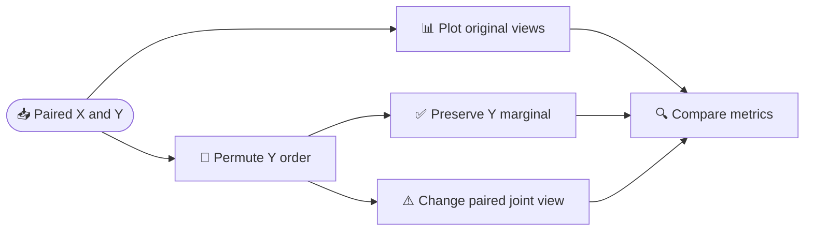

# Day 003｜2026-09-07｜Python 基本类型、控制流与配对数据

_Week 01 · 周一 2–4 小时 · 今天重新作为第三天；课件发布不代表学习已经完成_

---

> **今天的终点：** 在 120 分钟核心路线内，独立算出二维点的质心、轴对齐包围盒和离原点最近的点；再用散点图、边缘直方图和二维联合直方图区分“单路分布”与“样本配对关系”。有余力时再用第 3–4 小时完成函数化、自动测试和参数扫描。

> **资料用法：** 每个动作旁都有就地参考，阅读时间已包含在时间表中。正文给出核心概念、公式、代码、预期输出和排错路径；外链暂时打不开时，仍可只靠本页和 `materials/day003/` 完成核心路线。

## 📋 今日信息与提交物

| 项目 | 内容 |
| --- | --- |
| 日程依据 | [`SCHEDULE.md`](../SCHEDULE.md)：2026-09-07 = Day 003，周一 2–4 小时 |
| 前置知识 | 能打开终端并执行 `python file.py`；知道列表索引从 0 开始；不要求提前会统计学 |
| 必需环境 | Python 3.10+；核心几何任务只用标准库；可视化需要 NumPy 1.24–2.x、Matplotlib 3.7–3.x |
| 不要求 | GPU、ROS、真实医学数据、互信息估计器 |
| 核心输入 | 四个 `world` 坐标系二维点；1000 对无量纲合成特征 `(X_i,Y_i)` |
| 核心输出 | `point_stats.py`、两张配对对照图、终端输出、自己的三句解释、Day 003 日志 |
| 最终提交物 | `notes/Day003.md`；`experiments/Day003/point_stats.py`；`experiments/Day003/paired_views.py`；`experiments/Day003/output/` 两张 PNG；`progress.csv` 的真实记录 |
| 配套材料 | [`materials/day003/README.md`](../materials/day003/README.md)、两个参考脚本、9 项测试、依赖文件 |
| 合格线 | 80/100；不足 80 分按“补学方案”修复后再进入 Day 004 |

### 开始前的环境检查（计入核心路线 0–15 分钟）

> **就地参考：** [Python 命令行 `--version`](https://docs.python.org/3/using/cmdline.html#generic-options)（只看 `--version`，1 分钟；看完能判断解释器是否可用） · [Python 虚拟环境教程](https://docs.python.org/3/tutorial/venv.html#creating-virtual-environments)（只看创建与激活命令，3 分钟；看完能进入项目隔离环境） · [`materials/day003/README.md`](../materials/day003/README.md)（只看“环境与运行”，2 分钟；看完知道依赖与成功标志）。

从项目根目录逐行执行，不要复制提示符 `$`：

```bash
cd "/Users/meng/Documents/ChatGPT/每日基础学习"
pwd
python3 --version
git status --short --branch
python3 -m venv .venv
source .venv/bin/activate
python -m pip install -r materials/day003/requirements.txt
python -c "import numpy, matplotlib; print('numpy', numpy.__version__, 'matplotlib', matplotlib.__version__)"
mkdir -p experiments/Day003/output notes
```

成功标志：`pwd` 是项目根目录，Python 至少为 3.10，最后一条版本检查无报错。`.venv` 已存在时，重复执行创建命令不会删除它；若安装受阻，先完成只用标准库的几何任务并在日志记录错误原文，不要假装可视化已验证。

## 🎯 可检测学习目标

完成后你应能：

1. 区分 `int`、`float`、`str`、`bool`、列表、元组和字典，并预测一个嵌套索引的结果。
2. 解释 `if`、`for`、`while` 的执行与停止条件，避免无限循环，并区分 `=` 与 `==`。
3. 给二维点明确标注 shape、单位和坐标系，用循环计算质心、包围盒、最近点并处理空输入。
4. 给成对样本标注 `X.shape == Y.shape == (N,)`，区分散点图、边缘直方图和联合直方图展示的信息。
5. 通过打乱 `Y` 说明“边缘分布不变”不等于“配对关系不变”，且不把相关性误写为因果或互信息。
6. 从干净终端重跑两个脚本与 9 项测试，记录版本、种子、输出、失败案例和真实用时。

## ⏰ 2 小时核心路线与 2 小时进阶路线

每行资料都计入该时间块；不要在计划外另加“看视频时间”。核心 120 分钟形成最小完整闭环，进阶最多再用 120 分钟。

| 时间 | 路线与动作 | 就地参考（只看什么、多久、看完能做什么） | 检查点 |
| --- | --- | --- | --- |
| 0–15 分钟 | 环境检查；闭卷预测 `3/2`、`3//2`、`points[1][0]` | [Python §3.1](https://docs.python.org/3/tutorial/introduction.html#using-python-as-a-calculator)（数字、文本、列表首例，5 分钟；能辨认类型与索引） | 版本可打印；三项预测后再运行 |
| 15–35 分钟 | 学基本类型、容器、赋值与索引；完成最小练习 | [Python §3.1.1–3.1.3](https://docs.python.org/3/tutorial/introduction.html#lists)（列表索引与可变性，8 分钟；能读取嵌套点） | 写出列表、元组、字典各自用途 |
| 35–60 分钟 | 学 `if/for/while`；手算四点几何统计 | [Python §4.1–4.3](https://docs.python.org/3/tutorial/controlflow.html)（`if`、`for`、`range` 首例，8 分钟；能写有限循环） | 纸上得到质心 `(1,1)` 和包围盒 |
| 60–85 分钟 | 编写并运行 `point_stats.py`；检查单点、并列、空列表 | [Python `min`](https://docs.python.org/3/library/functions.html#min)（只看 iterable 与 `key` 定义，3 分钟；能解释逐项最小值） · [本页实践](#practice-one) | 四角点断言通过；空输入报清晰错误 |
| 85–105 分钟 | 运行配对可视化；读懂三张子图；打乱 `Y` 做对照 | [Matplotlib `hist2d`](https://matplotlib.org/stable/api/_as_gen/matplotlib.pyplot.hist2d.html)（只看 `bins` 和返回值，4 分钟；能解释格子计数） · [NumPy `corrcoef`](https://numpy.org/doc/stable/reference/generated/numpy.corrcoef.html)（只看定义与首例，3 分钟；能读取相关矩阵） | 生成原始图与打乱图；排序后的 `Y` 差为 0 |
| 105–120 分钟 | 跨线整合；闭卷快测；重跑脚本；填写核心日志 | [CMU 多模态课程 Lecture 1.1](https://cmu-multicomp-lab.github.io/mmml-course/fall2022/schedule/)（只看 multimodal challenges 条目，3 分钟；能说出 alignment 是配对前提） · [跟学指南](../BEGINNER_STUDY_GUIDE.md#资料已完成的统一标准)（2 分钟；能完成资料验收） | 回答 1–5 题；写 3 句解释与 1 个限制 |
| 120–145 分钟（进阶） | 把几何代码函数化；用参考实现核对边界 | [Python 定义函数](https://docs.python.org/3/tutorial/controlflow.html#defining-functions)（只看首个 `def` 例，5 分钟；能说清参数与返回值） · [`point_stats.py`](../materials/day003/point_stats.py) | 函数不依赖全局 `points`；3 个边界案例通过 |
| 145–170 分钟（进阶） | 拆分数据生成、绘图和打乱函数；运行 9 项测试 | [Python `unittest`](https://docs.python.org/3/library/unittest.html#basic-example)（只看 Basic example，5 分钟；能运行断言） · [`test_day003.py`](../materials/day003/test_day003.py) | `Ran 9 tests` 且 `OK` |
| 170–180 分钟（进阶） | 关闭网页，写“配对、边缘、联合”的三句解释 | [Deep Learning Book Chapter 3](https://www.deeplearningbook.org/contents/prob.html)（只看 marginal 与 joint probability 定义，5 分钟；能用自己的例子区分两者） | 不看网页写满 3 句，并写一个误区 |
| 180–205 分钟（进阶） | 扫描 `rho=0,0.5,0.9`，保持相同 `X/noise`，比较输出 | [NumPy `Generator.normal`](https://numpy.org/doc/stable/reference/random/generated/numpy.random.Generator.normal.html)（只看参数与例子，4 分钟；能说明 shape 与 seed） | 三组图或指标带 seed、N、rho 标签 |
| 205–225 分钟（进阶） | 主动制造非法 `rho`、空点、非有限坐标；读报错并修复 | [Python 异常](https://docs.python.org/3/tutorial/errors.html#exceptions)（只看异常结构，5 分钟；能指出异常类型和触发行） · [本页排错](#报错处理与失败案例) | 每个失败案例有“错误原文→原因→修复” |
| 225–240 分钟（进阶） | 做完整检测、按量表评分、填写日志与提交清单 | [本页 100 分量表](#rubric)（5 分钟；能给证据而非凭感觉打分） · [Pro Git 提交](https://git-scm.com/book/zh/v2/Git-%E5%9F%BA%E7%A1%80-%E8%AE%B0%E5%BD%95%E6%AF%8F%E6%AC%A1%E6%9B%B4%E6%96%B0%E5%88%B0%E4%BB%93%E5%BA%93)（只看 `status/add/commit` 例，5 分钟；能只提交自己的实验） | 得分 ≥80；提交物逐项存在；日志含真实用时 |

## 📚 概念讲解：从 Python 值到二维点

### 类型、容器、shape 与单位

> **概念参考：** [Python §3.1 Numbers, Text, Lists](https://docs.python.org/3/tutorial/introduction.html)（只读每类第一个例子，8 分钟；看完能预测下方输出）。

```python
count = 4                               # int：整数
scale = 0.5                             # float：浮点数
name = "sensor_A"                      # str：文本
valid = True                            # bool：真假
points = [(0, 0), (2, 0), (2, 2), (0, 2)]
metadata = {"unit": "m", "frame": "world"}
print(points[1], points[1][0], metadata["unit"])
print(3 / 2, 3 // 2, "3" + "2")
```

预期输出：

```text
(2, 0) 2 m
1.5 1 32
```

- `points` 是长度 `N=4` 的列表；每个元素是长度 2 的元组 `(x,y)`，可写成逻辑 shape `(N,2)`。
- `points[1]` 取第 2 个点 `(2,0)`；`points[1][0]` 再取其 x 坐标 `2`。
- 四个点都在 `world` 坐标系，x/y 单位都是米；shape 本身不保存单位或坐标系，必须在元数据和日志中另写。
- `"3"` 是文本，不是数字；`"3" + "2"` 做拼接得到 `"32"`。
- 列表适合保存同类、可增删的多个对象；元组表达一个固定结构的点；字典用有意义的键取值。

最小练习：给 `metadata` 添加 `"sensor": "A"`；把第 3 个点的 y 坐标打印出来；先写预测，再运行。

### 分支、循环与不变量

> **概念参考：** [Python `if`](https://docs.python.org/3/tutorial/controlflow.html#if-statements) 与 [`for`](https://docs.python.org/3/tutorial/controlflow.html#for-statements)（各看首例，共 6 分钟；看完能解释缩进块何时执行）。

```python
for x, y in points:
    if y > 0:
        print("above x-axis", x, y)

i = 0
while i < len(points):
    print(i, points[i])
    i += 1
```

`for x,y in points` 每轮拆出一个点；`if` 只在条件为真时执行缩进块。`while` 必须让停止条件逐步接近假值，此处 `i += 1` 是关键；删掉它会反复访问同一个点。`=` 给变量赋值，`==` 比较两边是否相等。

几何循环中的不变量是：处理完前 `k` 个点后，`sx/sy` 是前 `k` 个坐标和，`xmin/xmax/ymin/ymax` 是前 `k` 个点的边界，`nearest` 是前 `k` 个点中距离平方最小者。每加入一个点就更新这些量，循环结束即覆盖全部输入。

<a id="practice-one"></a>

## ✍️ 实践一：二维点的几何统计

### 输入、公式与手算

> **就地参考：** [Python 数字运算](https://docs.python.org/3/tutorial/introduction.html#numbers)（只看 `/`、`**`，3 分钟；看完能手算均值和平方） · [`materials/day003/point_stats.py`](../materials/day003/point_stats.py)（只在自己尝试后核对，5 分钟；看完能定位边界检查）。

输入 `P={(x_i,y_i)}_{i=1}^N`，所有点必须在同一 `world` 坐标系，坐标单位为米：

\[
c_x=\frac{1}{N}\sum_{i=1}^{N}x_i,\qquad
c_y=\frac{1}{N}\sum_{i=1}^{N}y_i.
\]

质心输出 `(c_x,c_y)`，单位仍为米。轴对齐包围盒为 `((xmin,ymin),(xmax,ymax))`。离原点最近的点最小化

\[
d_i^2=x_i^2+y_i^2,
\]

其中 `d_i²` 的单位是平方米。比较距离平方即可，无需开方；平方根是单调函数，所以最小者不变。若并列，保留输入中最先出现的点。

四角点 `[(0,0),(2,0),(2,2),(0,2)]`：x 坐标和为 4，y 坐标和为 4，`N=4`，故质心 `(1,1)`；包围盒两角为 `(0,0)` 与 `(2,2)`；最近点 `(0,0)`。

### 完整可运行代码

先把下列代码保存为 `experiments/Day003/point_stats.py`。核心路线只要求有限二维数值；进阶路线再用配套实现补严格验证。

```python
import math

points = [(0, 0), (2, 0), (2, 2), (0, 2)]
if not points:
    raise ValueError("points must not be empty")
if any(len(point) != 2 for point in points):
    raise ValueError("each point must contain x and y")
if any(not math.isfinite(value) for point in points for value in point):
    raise ValueError("coordinates must be finite")

sx = sy = 0.0
xmin = xmax = points[0][0]
ymin = ymax = points[0][1]
nearest = points[0]
best_d2 = nearest[0] ** 2 + nearest[1] ** 2

for x, y in points:
    sx += x
    sy += y
    xmin = min(xmin, x)
    xmax = max(xmax, x)
    ymin = min(ymin, y)
    ymax = max(ymax, y)
    d2 = x * x + y * y
    if d2 < best_d2:
        nearest = (x, y)
        best_d2 = d2

centroid = (sx / len(points), sy / len(points))
bbox = ((xmin, ymin), (xmax, ymax))
print("frame=world; coordinate unit=m")
print("centroid (m):", centroid)
print("bbox (m):", bbox)
print("nearest (m):", nearest)
print("nearest squared distance (m^2):", best_d2)
assert centroid == (1.0, 1.0)
assert bbox == ((0, 0), (2, 2))
assert nearest == (0, 0)
```

执行：

```bash
python experiments/Day003/point_stats.py
```

预期核心输出：

```text
frame=world; coordinate unit=m
centroid (m): (1.0, 1.0)
bbox (m): ((0, 0), (2, 2))
nearest (m): (0, 0)
nearest squared distance (m^2): 0
```

必须再检查：

1. 单点 `[(3,-2)]`：质心和最近点都是 `(3,-2)`，包围盒两角相同。
2. 并列 `[(-2,0),(2,0)]`：由于更新条件是 `<` 而非 `<=`，保留 `(-2,0)`。
3. 空列表：应得到 `ValueError: points must not be empty`，而不是除以零或模糊报错。

## 📊 实践二：配对关系、边缘与联合视图

### 随机变量、shape 与普通基线

> **概念参考：** [Deep Learning Book Chapter 3](https://www.deeplearningbook.org/contents/prob.html)（只定位 joint probability 与 marginal probability，6 分钟；看完能区分联合与边缘） · [CMU 多模态课程 Lecture 1.1](https://cmu-multicomp-lab.github.io/mmml-course/fall2022/schedule/)（只看 multimodal representation/alignment 条目，4 分钟；看完能解释样本对应为什么重要）。

设 `X` 与噪声 `E` 是相互独立的标准高斯随机变量，构造

\[
Y=\rho X+\sqrt{1-\rho^2}E,
\]

今天取 `rho=0.8`。`X`、`Y` 都是无量纲合成特征；在代码里 `x.shape == y.shape == (N,)`，索引相同的 `(x[i],y[i])` 才是一对。理论上方差均为 1、Pearson 相关为 `rho`；有限样本的实测值不会恰好等于 0.8。

今天选择的普通统计基线是 Pearson 样本相关系数：

\[
r=\frac{\sum_i(x_i-\bar x)(y_i-\bar y)}
{\sqrt{\sum_i(x_i-\bar x)^2}\sqrt{\sum_i(y_i-\bar y)^2}}.
\]

它检测线性关联，但不证明因果，也不能覆盖所有非线性依赖。今天不计算互信息：二维直方图的格子计数不是互信息值，估计 MI 还需要概率估计、离散化选择和有限样本审计。



### 三种图分别回答什么

> **绘图参考：** [Matplotlib `scatter`](https://matplotlib.org/stable/api/_as_gen/matplotlib.pyplot.scatter.html)（只看 x/y 参数，2 分钟） · [`hist`](https://matplotlib.org/stable/api/_as_gen/matplotlib.pyplot.hist.html)（只看 `bins` 与返回计数，2 分钟） · [`hist2d`](https://matplotlib.org/stable/api/_as_gen/matplotlib.pyplot.hist2d.html)（只看输入、`bins` 和返回值，4 分钟；看完能读出颜色代表格子计数）。

| 视图 | 输入 | 输出 | 能回答 | 不能单独回答 |
| --- | --- | --- | --- | --- |
| 散点图 | 每对 `(x_i,y_i)` | 每个样本一个点 | 配对形态、趋势、异常点 | 精确概率、因果方向 |
| 两张边缘直方图 | `x` 与 `y` 分别分箱 | 每个区间的频数 | 每一路的大致位置、尺度、形状 | 哪个 `x_i` 对应哪个 `y_i` |
| 二维联合直方图 | 成对的 `(x_i,y_i)` | 网格计数 `H[j,k]` | 哪些 x/y 区间共同出现 | 连续真分布、自动得到 MI |

二维计数可写作 `H[j,k] = Σ_i 1{x_i 在第 j 箱且 y_i 在第 k 箱}`；`1{条件}` 在条件成立时取 1，否则取 0。`bins=30` 表示两个轴各分 30 个箱，最多有 `30×30` 个格子。箱宽改变时图会改变，所以必须记录参数。

### 完整可运行代码与对照实验

> **边做边查：** [NumPy `Generator.normal`](https://numpy.org/doc/stable/reference/random/generated/numpy.random.Generator.normal.html)（只看 `size`，2 分钟；能生成 `(1000,)`） · [NumPy `Generator.permutation`](https://numpy.org/doc/stable/reference/random/generated/numpy.random.Generator.permutation.html)（只看一维数组例，2 分钟；能在不改取值集合的情况下重排） · [`paired_views.py`](../materials/day003/paired_views.py)（自己运行后核对，5 分钟；能拆出生成、打乱、绘图三步）。

核心路线直接运行已经验证的配套脚本，并把输出保存到自己的实验目录：

```bash
python materials/day003/paired_views.py --out-dir experiments/Day003/output | tee experiments/Day003/output/metrics.txt
```

完整实现如下；保存为 `experiments/Day003/paired_views.py` 后也能独立运行：

```python
from pathlib import Path
import numpy as np
import matplotlib
matplotlib.use("Agg")
import matplotlib.pyplot as plt

out = Path("experiments/Day003/output")
out.mkdir(parents=True, exist_ok=True)
rng = np.random.default_rng(3)
x = rng.normal(size=1000)
noise = rng.normal(size=1000)
y = 0.8 * x + 0.6 * noise
shuffled_y = np.random.default_rng(4).permutation(y)

assert x.shape == y.shape == shuffled_y.shape == (1000,)
assert np.array_equal(np.sort(y), np.sort(shuffled_y))

def save_views(current_y, filename, title_prefix):
    fig, axes = plt.subplots(1, 3, figsize=(12, 3.6))
    axes[0].scatter(x, current_y, s=8, alpha=0.3)
    axes[0].set(xlabel="X (unitless)", ylabel="Y (unitless)", title=f"{title_prefix}: pairs")
    axes[1].hist(x, bins=30, alpha=0.5, label="X")
    axes[1].hist(current_y, bins=30, alpha=0.5, label="Y")
    axes[1].set(xlabel="Value (unitless)", ylabel="Count", title=f"{title_prefix}: marginals")
    axes[1].legend()
    h = axes[2].hist2d(x, current_y, bins=30)
    axes[2].set(xlabel="X (unitless)", ylabel="Y (unitless)", title=f"{title_prefix}: joint")
    fig.colorbar(h[3], ax=axes[2], label="Count")
    fig.tight_layout()
    fig.savefig(out / filename, dpi=150)
    plt.close(fig)

save_views(y, "paired_original.png", "Original")
save_views(shuffled_y, "paired_shuffled.png", "Shuffled")
print("seed=3, n=1000, rho_target=0.8")
print("original r:", np.corrcoef(x, y)[0, 1])
print("shuffled r:", np.corrcoef(x, shuffled_y)[0, 1])
print("sorted-y maximum difference:", np.max(np.abs(np.sort(y) - np.sort(shuffled_y))))
```

成功标志：

- 生成 `paired_original.png` 与 `paired_shuffled.png`，文件非空；
- 原始样本相关明显为正并接近 0.8；打乱后通常接近 0，但不保证恰好为 0；
- `sorted-y maximum difference` 精确显示 `0.0`，证明打乱前后的 `Y` 取值集合相同；
- 原始与打乱图的 `Y` 边缘直方图保持一致，而散点和联合直方图明显改变。

## 🔗 跨线整合与小项目

### 从几何点到两路模态

几何任务和配对任务都能写成二维数表，但语义不同：

- 几何点 `(x,y)` 是同一 `world` 坐标系里的位置，两个轴单位都是米；行号通常只表示点的枚举顺序。
- 配对样本 `(X_i,Y_i)` 是第 `i` 个样本的两路无量纲特征；行号承载“同一个样本”的对应关系。
- 打乱 `Y` 模拟样本编号错位：单路 `Y` 的值没有丢失，但跨模态对应关系被破坏。

> **整合参考：** [CMU 多模态课程 Lecture 1.1/1.2](https://cmu-multicomp-lab.github.io/mmml-course/fall2022/schedule/)（只看 representation、alignment、fusion 三个标题，5 分钟；看完能把本实验归为 alignment 检查） · [本仓库信息论边界](../INFORMATION_THEORY_SCOPE.md#2-从问题选择工具)（只看“研究问题→首选工具”表，3 分钟；能解释今天为何用几何检查和相关基线而不强行套 MI）。

### 小项目规格：配对完整性审计

| 项目 | 要求 |
| --- | --- |
| 输入 | `seed=3`、`N=1000`、`rho=0.8`；`x,y` shape 均为 `(1000,)`、无量纲 |
| 步骤 | 生成原始配对 → 检查 shape/有限值 → 画三视图 → 打乱 `Y` → 再画三视图 → 比较 `r` 与排序后的 `Y` |
| 检查点 1 | 原始 `r` 明显为正；记录实际值，不硬编码为 0.8 |
| 检查点 2 | `np.sort(y)` 与 `np.sort(shuffled_y)` 完全相同 |
| 检查点 3 | 两张 PNG 非空，标题、轴名、单位与 colorbar 完整 |
| 输出 | 两张 PNG、`metrics.txt`、3 句自己的解释、1 个限制或疑问 |
| 验收 | 任务性能：原始/打乱相关对比；鲁棒性：固定 seed 可重跑；成本：核心任务 ≤20 分钟；失败案例：至少记录一次错误或写明“无错误”并主动测试非法输入 |

不要写“打乱后 X 与 Y 已证明独立”或“高相关说明 X 导致 Y”。这是受控合成例子；Pearson `r` 只概括线性配对关系。

## 🔧 运行测试、预期输出与排错

### 一键验证

> **验证参考：** [`materials/day003/README.md`](../materials/day003/README.md)（只看运行命令与成功标志，3 分钟） · [Python `unittest` 命令行](https://docs.python.org/3/library/unittest.html#command-line-interface)（只看 `-v`，2 分钟；能识别测试数与失败名）。

```bash
python materials/day003/point_stats.py
python materials/day003/paired_views.py --out-dir artifacts/day003
python -m unittest materials/day003/test_day003.py -v
```

预期关键输出（相关系数保留实际打印值，不要求逐位相同）：

```text
All point-stat checks passed.
sorted-y maximum difference: 0.0
Ran 9 tests in ...s
OK
```

9 项测试覆盖四角点、单点、并列最近、空输入、非有限坐标、随机数可复现、打乱保持边缘、非法 `rho` 和图片生成。

### 报错处理与失败案例

| 症状 | 原因 | 修复 | 修复后检查 | 参考 |
| --- | --- | --- | --- | --- |
| `ModuleNotFoundError: numpy` | 当前解释器未安装依赖或虚拟环境未激活 | `source .venv/bin/activate` 后重新安装 requirements | 版本检查能打印 NumPy | [Python venv](https://docs.python.org/3/tutorial/venv.html)（只看激活与安装，4 分钟） |
| `IndentationError` | `if/for/while/def` 后的代码块缩进不一致 | 统一使用 4 个空格，不混 Tab | `python -m py_compile 文件.py` 无输出 | [Python 缩进说明](https://docs.python.org/3/reference/lexical_analysis.html#indentation)（只看 Indentation，3 分钟） |
| `ValueError: points must not be empty` | 没有可计算的点，`N=0` | 提供至少一个合法点；保留检查，不删除异常 | 单点测试通过 | [Python 异常](https://docs.python.org/3/tutorial/errors.html#exceptions)（只看异常信息结构，3 分钟） |
| 图片未出现 | 输出目录错误或脚本提前失败 | 先看终端 traceback；用明确 `--out-dir` | `ls -lh` 显示两张非空 PNG | [Matplotlib `savefig`](https://matplotlib.org/stable/api/_as_gen/matplotlib.pyplot.savefig.html)（只看 `fname`/`dpi`，3 分钟） |
| 打乱后的相关仍不很接近 0 | 有限样本随机波动，或错误复用了原 `y` | 核对传入的是 `shuffled_y`；记录实际值，不反复换 seed 挑结果 | 排序后差为 0，图确实改变 | [NumPy `corrcoef`](https://numpy.org/doc/stable/reference/generated/numpy.corrcoef.html)（只看返回矩阵，3 分钟） |
| `rho` 导致 `sqrt` 非法 | `rho` 超出 `[-1,1]` | 在生成前验证范围并抛 `ValueError` | `rho=1.1` 测试通过（即正确拒绝） | [`paired_views.py`](../materials/day003/paired_views.py)（只看 `make_pairs`，3 分钟） |

## 🤔 检测题、动手任务与迁移题

> **作答规则：** 先关闭网页独立作答；每题卡住超过 3 分钟，再打开题后列出的资料，只看指定小节。资料用于补概念，不能直接复制为答案。

1. `points[1]` 与 `points[1][0]` 分别返回什么？列表、元组、字典在今天各承担什么角色？卡住后看 [Python Lists](https://docs.python.org/3/tutorial/introduction.html#lists) 的索引首例。
2. `for` 与 `while` 各靠什么结束？删掉 `i += 1` 为什么危险？卡住后看 [Python §3.2 while](https://docs.python.org/3/tutorial/introduction.html#first-steps-towards-programming) 与 [§4.2 for](https://docs.python.org/3/tutorial/controlflow.html#for-statements)。
3. 对 `[(-2,0),(2,0)]`，为什么两个点同样近但程序保留第一个？把 `<` 改为 `<=` 会怎样？卡住后回看[实践一](#practice-one)的更新条件。
4. 质心、包围盒和最近点的输入/输出分别是什么？坐标与距离平方的单位为何不同？卡住后回看[输入、公式与手算](#输入公式与手算)。
5. 打乱 `Y` 后，为什么 `Y` 的边缘直方图不变，而散点图与二维联合直方图改变？卡住后看 [Deep Learning Book Chapter 3](https://www.deeplearningbook.org/contents/prob.html) 的 marginal/joint 定义。
6. 为什么原始样本相关不必精确等于 `rho=0.8`？零相关为什么一般不能推出独立？卡住后看 [NumPy `corrcoef`](https://numpy.org/doc/stable/reference/generated/numpy.corrcoef.html) 的定义，并回看本页普通基线限制。
7. 为什么今天不应把二维联合直方图称作“互信息结果”？卡住后看 [`INFORMATION_THEORY_SCOPE.md`](../INFORMATION_THEORY_SCOPE.md#5-使用边界与常见误区) 的 MI 边界。

**动手任务：** 不看参考实现，把 `point_stats` 写成接收点列表并返回字典的函数；让四角点、单点、并列和空列表四种测试通过。完成后才对照 [`materials/day003/point_stats.py`](../materials/day003/point_stats.py) 的函数接口与验证顺序。

**迁移题：** 两个传感器各有 1000 条记录，单独看温度与振动的直方图都正常，但怀疑时间戳错了一位。设计一个不使用 MI 的最小审计：明确输入、配对键、图、指标、成功/失败信号和限制。卡住后只看 [CMU multimodal alignment 课程条目](https://cmu-multicomp-lab.github.io/mmml-course/fall2022/schedule/) 5 分钟。

<details>
<summary><strong>参考答案与自检要点</strong></summary>

1. `points[1]` 是第 2 个完整点 `(2,0)`，`points[1][0]` 是其 x 坐标 `2`；列表保存多个点，元组表示一个固定二维点，字典保存带名称的元数据。
2. `for` 在序列耗尽时结束；`while` 在条件变假时结束。没有 `i += 1` 时 `i < len(points)` 一直为真，会无限循环。
3. 两点距离平方都为 4；条件 `d2 < best_d2` 不在相等时覆盖已有值，所以保留首项。改成 `<=` 会让后出现者覆盖前项。
4. 三者都输入同一坐标系的点；质心输出平均位置，包围盒输出两角，最近点输出一个原始点。坐标是米，平方距离是平方米。
5. permutation 只改变顺序，不改变 `Y` 的取值多重集合，所以单变量统计保持；相同索引的 `(X_i,Y_i)` 被重新配对，因此联合视图和相关改变。
6. `r` 是有限样本估计，会有随机波动。零 Pearson 相关只排除线性关联；非线性依赖仍可能存在。
7. 联合直方图只是分箱计数。MI 还需归一化概率、边缘概率、对数比值与估计偏差讨论；图本身不是一个 MI 数值。
8. 动手任务应把验证放在除法与索引前，并保留并列规则；不能只对四角点硬编码答案。
9. 迁移题示例：按时间戳/样本 ID 明确 join；画原始与人为错位的散点或差值时序；比较相关和时间延迟互相关；成功信号是正确对齐在预期延迟上更一致，失败信号是错位不改变指标。限制是线性相关可能漏掉非线性关系，且共同趋势可制造伪相关。

</details>

---

<a id="rubric"></a>

## ✅ 100 分量表与合格线

| 项目 | 分值 | 满分证据 | 常见扣分 |
| --- | ---: | --- | --- |
| 类型与控制流 | 15 | 闭卷解释类型、索引、`if/for/while`，最小练习正确 | 只会复制；说不清停止条件 |
| 几何公式与语义 | 15 | 手算正确；写清 `world`、米、平方米及 shape `(N,2)` | 漏单位/坐标系；混淆质心与最近点 |
| 几何程序 | 20 | 四角点、单点、并列、空输入均按规格工作 | 只验证正常样例；并列规则不确定 |
| 配对可视化 | 20 | 两张 PNG 非空；三视图轴名、标题、colorbar 完整 | 只画一张；未记录 bins/seed/N |
| 解释与边界 | 15 | 正确区分边缘/联合/相关；不声称因果、独立或真实 MI | 把低相关写成独立；把图称为 MI |
| 可复现与测试 | 10 | 记录 Python/NumPy/Matplotlib 版本；脚本与 9 项测试重跑通过 | 无版本/种子；声称未运行结果 |
| 资料验收与日志 | 5 | 记录实际页面与用时；3 句解释；复现 1 项；写 1 个限制 | 只收藏链接或复制原文 |
| **总分** | **100** | **≥80 合格，且几何程序、配对可视化均不得为 0 分** | 低于 80 进入补学 |

### 补学方案

按失分项只补最短路径，不扩展新内容：

- 类型/控制流不足：重做 [Python §3.1](https://docs.python.org/3/tutorial/introduction.html) 的 Numbers/Lists 首例和 [§4.1–4.3](https://docs.python.org/3/tutorial/controlflow.html) 的 `if/for/range` 首例，共 20 分钟；关闭网页后重写循环。
- 几何程序不足：重新手算单点与并列案例，再运行 [`test_day003.py`](../materials/day003/test_day003.py) 中 `PointStatsTests`，20 分钟；成功标志是 5 项几何测试通过。
- 配对概念不足：只读 [Deep Learning Book Chapter 3](https://www.deeplearningbook.org/contents/prob.html) 的 marginal/joint 定义 8 分钟，重新画原始/打乱两图 12 分钟；必须写出哪些量变、哪些不变。
- 可复现不足：按 [`materials/day003/README.md`](../materials/day003/README.md) 从项目根目录重跑 15 分钟，保存完整终端输出与版本。
- 补学后只重测对应项目；仍低于 80 时，在 `notes/Day003.md` 写清阻塞，不进入 Day 004。

## 📝 复盘、完成清单与日志模板

### 今日资料验收

> **验收参考：** [`BEGINNER_STUDY_GUIDE.md`](../BEGINNER_STUDY_GUIDE.md#资料已完成的统一标准)（只看 5 个勾选项，3 分钟；看完能判定“看过”与“学会”的区别）。

- [ ] 在 `notes/Day003.md` 记录实际打开的页面标题、具体小节和实际用时。
- [ ] 关闭网页后写出至少 3 句自己的解释，不复制原文。
- [ ] 复现一个公式、命令、代码输出或图；写明证据路径。
- [ ] 写出一个假设、限制、失败条件或尚未解决的问题。
- [ ] 独立回答检测题；卡住后才按题目所列资料补看。

### 完成清单

> **提交参考：** [Pro Git：记录更新](https://git-scm.com/book/zh/v2/Git-%E5%9F%BA%E7%A1%80-%E8%AE%B0%E5%BD%95%E6%AF%8F%E6%AC%A1%E6%9B%B4%E6%96%B0%E5%88%B0%E4%BB%93%E5%BA%93)（只看 `git status`、`git add`、`git commit` 示例，8 分钟；看完能只暂存自己的实验文件）。

- [ ] 核心路线实际用时不超过 120 分钟；进阶路线另外记录，不混填。
- [ ] `point_stats.py` 明确 shape、坐标系、单位并通过三个边界案例。
- [ ] 原始与打乱两张 PNG 均非空，`metrics.txt` 记录 seed/N/rho/相关。
- [ ] 9 项仓库测试真实运行并显示 `OK`；未运行不得勾选。
- [ ] 完成至少 5 道检测题、1 个动手任务和 1 个迁移题。
- [ ] 按 100 分量表附证据评分；低于 80 已执行补学。
- [ ] `progress.csv` 只填写学习后的真实分钟数、得分和提交哈希，不预填。
- [ ] `git status --short` 检查只暂存 Day 003 的个人实验与日志，不包含密钥、`.venv` 或无关文件。

### 可复制日志模板

> **记录参考：** [`templates/daily-note.md`](../templates/daily-note.md)（只看字段结构，3 分钟；看完能把证据落到固定位置）。

```markdown
# Day 003 学习日志｜2026-09-07

- 核心开始/结束：
- 核心实际分钟：
- 进阶实际分钟：
- Python / NumPy / Matplotlib 版本：
- seed / N / rho / bins：

## 资料记录

| 页面与具体小节 | 实际分钟 | 关闭网页后的三句解释 | 复现证据 | 限制或疑问 |
| --- | ---: | --- | --- | --- |
|  |  |  |  |  |

## 输出证据

- 几何脚本输出：
- 边界案例：
- 原始/打乱相关：
- 两张图路径：
- 9 项测试结果：

## 检测与评分

- 题 1–7：
- 动手任务：
- 迁移题：
- 量表各项：
- 总分：__/100
- 是否达到 80 分：
- 补学与重测：

## 复盘

- 今天最确定的一点：
- 最容易犯的错误：
- 明天开始前要补的内容：
- 失败原文 → 原因 → 修复：
```

## 🔗 今日资料

下表是今天 8 个核心链接的总索引；它不能替代各任务旁的就地阅读说明。所有链接已于 2026-09-07 在线核验。

| 资料 | 类型 | 今天只看 | 为什么今天需要 | 建议用时 | 必读/选读 | 看完必须能做什么 |
| --- | --- | --- | --- | ---: | --- | --- |
| [Python §3：Informal Introduction](https://docs.python.org/3/tutorial/introduction.html) | 官方教程 | Numbers、Text、Lists、while 首例 | 建立类型、索引、赋值和循环最小模型 | 12 分钟 | 必读 | 预测最小例子并读取嵌套点 |
| [Python §4：Control Flow](https://docs.python.org/3/tutorial/controlflow.html) | 官方教程 | `if`、`for`、`range` 与首个 `def` | 写出可终止循环，并为进阶函数化做准备 | 12 分钟 | 必读 | 独立写点遍历与条件更新 |
| [Python venv](https://docs.python.org/3/tutorial/venv.html) | 官方教程 | 创建、激活、pip 安装 | 让依赖与项目隔离且可复现 | 5 分钟 | 必读 | 激活 `.venv` 并打印版本 |
| [NumPy `Generator.normal`](https://numpy.org/doc/stable/reference/random/generated/numpy.random.Generator.normal.html) | 官方 API | `size` 参数与首例 | 生成固定 shape 的可复现合成样本 | 4 分钟 | 必读 | 生成 `(1000,)` 的 X 与噪声 |
| [NumPy `corrcoef`](https://numpy.org/doc/stable/reference/generated/numpy.corrcoef.html) | 官方 API | 定义、返回 shape、首例 | 提供不强行使用 MI 的线性依赖基线 | 5 分钟 | 必读 | 读取 2×2 相关矩阵的非对角项 |
| [Matplotlib `hist2d`](https://matplotlib.org/stable/api/_as_gen/matplotlib.pyplot.hist2d.html) | 官方 API | `x/y`、`bins`、返回值 | 正确解释二维格子计数及 colorbar | 5 分钟 | 必读 | 生成带标签的联合直方图 |
| [CMU 11-777 课程表](https://cmu-multicomp-lab.github.io/mmml-course/fall2022/schedule/) | 多模态公开课 | Lecture 1.1/1.2 的 representation、alignment、fusion 标题 | 把样本错位放入多模态 alignment 问题 | 5 分钟 | 必读 | 说明边缘正常为何不保证跨模态对齐 |
| [Deep Learning Book Chapter 3](https://www.deeplearningbook.org/contents/prob.html) | 作者教材 | joint 与 marginal probability 定义 | 为三种图建立概率语义，不提前估计 MI | 8 分钟 | 选读；概念卡住时必读 | 用自己的例子区分边缘和联合 |

下一学习日是 2026-09-08，Day 004「函数、模块和异常」。只有 Day 003 学习后真实达到 80 分，才进入下一天；今天不得提前发布 Day 004。
